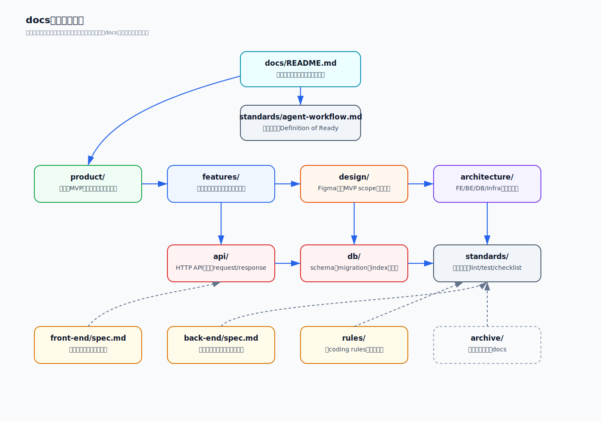
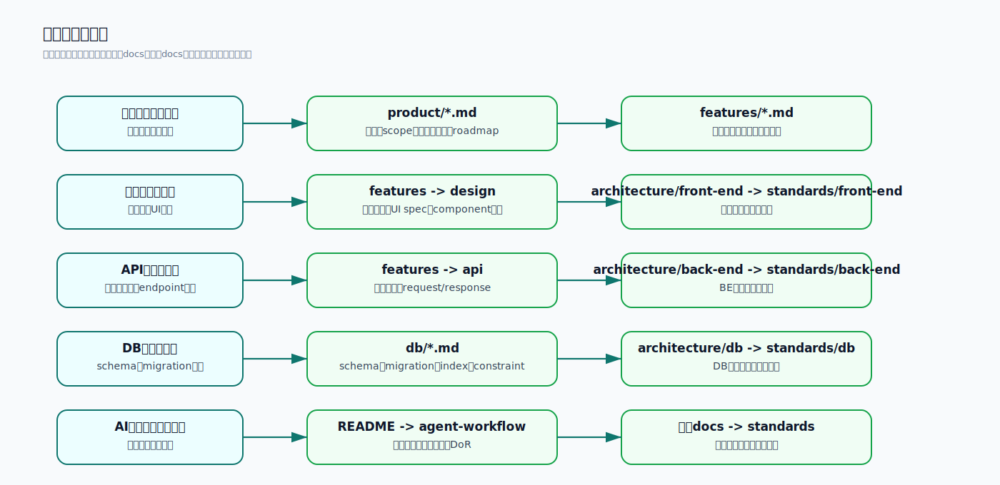

# Documentation Map

## 目的

`docs/` 配下のディレクトリとファイルが、どこでどうつながっているかを人間が把握しやすくするための地図です。

実装や仕様確認の入口は `README.md` です。このファイルは、関係性を図で確認したいときに参照します。

## 全体像

## 目的別の読み方

## ディレクトリ別ファイル一覧

### `docs/`

| ファイル | 役割 |
|---|---|
| `README.md` | docs全体の入口。読む順番、正の優先順位、ディレクトリ責務を定義する。 |
| `doc-map.md` | docs全体の関係図。人間がつながりを把握するための地図。 |

### `product/`

プロダクト全体の目的、MVP範囲、用語、未決事項、ロードマップを置きます。

| ファイル | 役割 |
|---|---|
| `product/spec.md` | product仕様の互換入口。詳細ファイルへの案内役。 |
| `product/overview.md` | アプリの目的、思想、最優先仕様、技術スタック概要。 |
| `product/scope.md` | MVPでやること、やらないこと、画面一覧。scope判断の中心。 |
| `product/glossary.md` | 用語定義。金額、残額、収入、固定費などの意味を固定する。 |
| `product/open-questions.md` | 未決事項と確認ポイントを管理する。 |
| `product/roadmap.md` | 実装順序と将来対応の整理。 |

### `features/`

ユーザー視点の機能仕様を置きます。画面表示、操作、期待挙動、完了条件が中心です。

| ファイル | 役割 |
|---|---|
| `features/auth.md` | ログイン、ログアウト、未ログインガード、Supabase Auth連携。 |
| `features/home.md` | トップ画面。今月残額、金額だけの出費登録、Undo、今日の出費。 |
| `features/incomes.md` | 収入画面。収入の登録・編集・削除、使えるお金に含める設定。 |
| `features/fixed-costs.md` | 固定費画面。固定費の登録・編集・削除、開始月、有効状態表示。 |
| `features/calendar.md` | カレンダー画面。日別出費と日別終了時点残額。 |
| `features/annual-summary.md` | 年間サマリー画面。年間全収入、固定費、出費、収支、月別出費推移、年間収支内訳。 |
| `features/pwa.md` | スマホホーム画面追加など、PWA表示に関するMVP仕様。 |

### `design/`

Figma Makeなどのデザイン案を、MVP scopeから外れない形で実装準備へ落とす場所です。

| ファイル | 役割 |
|---|---|
| `design/README.md` | design docsの入口。読む順番を定義する。 |
| `design/figma-make-scope-review.md` | Figma Make案がMVP scopeに合っているかのレビュー。 |
| `design/mvp-implementation-spec.md` | UI実装時に守るdesign spec。残す/削る/禁止するUIを定義する。 |
| `design/component-breakdown.md` | Atomic Design寄りのコンポーネント分解と配置候補。 |
| `design/implementation-task-breakdown.md` | Figma確定前に進められる実装タスク、依存関係、完了条件。 |

### `architecture/`

システム全体と各領域の設計方針を置きます。実装規約ではなく、責務分担と構成の考え方が中心です。

| ファイル | 役割 |
|---|---|
| `architecture/overview.md` | 全体アーキテクチャの入口。FE/BE/DB/Infraの関係。 |
| `architecture/front-end.md` | Next.js、MUI、TanStack Query、Atomic Design寄り構成などのFE設計。 |
| `architecture/front-end-domain-api-hooks.md` | domain型、API DTO、mapper、query key、hooks、cache更新方針。 |
| `architecture/back-end.md` | Go/Echo/GORM、認証、usecase/repositoryなどBE設計。 |
| `architecture/db.md` | PostgreSQL、schema、集計、制約のDB設計方針。 |
| `architecture/infra.md` | Vercel、Render、SupabaseなどMVPインフラ方針。 |

### `api/`

HTTP API契約を置きます。endpoint、request、response、仕様、エラー方針が中心です。

| ファイル | 役割 |
|---|---|
| `api/common.md` | API共通仕様。認証、日付、成功レスポンス、エラーレスポンス。 |
| `api/expenses.md` | 出費登録、月別/日別出費取得、出費削除API。 |
| `api/incomes.md` | 収入登録、月別収入取得、収入更新、収入削除API。 |
| `api/fixed-costs.md` | 固定費登録、対象月固定費取得、更新、削除API。 |
| `api/monthly-summary.md` | 月次サマリー取得APIと計算式。 |
| `api/expense-calendar.md` | カレンダー用の日別出費・日別残額API。 |
| `api/annual-summary.md` | 年間サマリー取得APIと計算式。 |

### `db/`

DB仕様を置きます。schema、migration、index、constraint、aggregationが中心です。

| ファイル | 役割 |
|---|---|
| `db/spec.md` | DB仕様の互換入口。詳細ファイルへの案内役。 |
| `db/schema.md` | テーブル、カラム、型、リレーションの定義。 |
| `db/migrations.md` | migration作成・適用・管理方針。 |
| `db/indexes.md` | 月次、日次、年次検索に必要なindex方針。 |
| `db/constraints.md` | foreign key、check、uniqueなどDB制約の方針。 |
| `db/aggregation.md` | 月次、日次、年次集計のDB前提と計算方針。 |

### `tools/`

開発やAIエージェント利用を補助するツールの使い方を置きます。

| ファイル | 役割 |
|---|---|
| `tools/genshijin.md` | genshijinの導入状態、起動方法、強度レベル、解除方法、注意点。 |

### `standards/`

実装規約、チェックリスト、AIエージェント向け作業手順を置きます。

| ファイル | 役割 |
|---|---|
| `standards/agent-workflow.md` | AIエージェントと実装者向けの作業手順、読む順番、Definition of Ready。 |
| `standards/implementation-quality-gates.md` | 実装前後に通す保守性ゲート。コメント、責務分離、style、UI/API/DB整合を固定する。 |
| `standards/common.md` | 全領域共通の実装規約。命名、責務、レビュー、コメント方針など。 |

#### `standards/front-end/`

| ファイル | 役割 |
|---|---|
| `standards/front-end/index.md` | フロントエンド規約の入口。最優先ルールと配置判断。 |
| `standards/front-end/typescript.md` | TypeScript型、安全性、禁止事項。 |
| `standards/front-end/react.md` | React component、hooks、Next.js App Router規約。 |
| `standards/front-end/data-fetching.md` | TanStack Query、API通信、cache更新方針。 |
| `standards/front-end/ui.md` | MUI、theme、Atomic Design寄りUI、sx、アクセシビリティ。 |
| `standards/front-end/testing.md` | フロントエンドテスト方針。 |
| `standards/front-end/checklist.md` | フロントエンド実装完了前チェックリスト。 |

#### `standards/back-end/`

| ファイル | 役割 |
|---|---|
| `standards/back-end/index.md` | バックエンド規約の入口。最優先ルールと参照順。 |
| `standards/back-end/architecture.md` | オニオンアーキテクチャ、handler/usecase/repository責務。 |
| `standards/back-end/go.md` | Goの書き方、型、エラー、命名、禁止事項。 |
| `standards/back-end/http.md` | Echo handler、request/response、HTTP status、エラー形式。 |
| `standards/back-end/persistence.md` | GORM、repository、transaction、DBアクセス規約。 |
| `standards/back-end/auth.md` | Supabase Auth JWT検証、認証・認可、user_id扱い。 |
| `standards/back-end/testing.md` | バックエンドテスト方針。 |
| `standards/back-end/checklist.md` | バックエンド実装完了前チェックリスト。 |

#### `standards/db/`

| ファイル | 役割 |
|---|---|
| `standards/db/index.md` | DB規約の入口。最優先ルールと参照順。 |
| `standards/db/naming.md` | DB命名規約。table、column、index、constraint名。 |
| `standards/db/migrations.md` | migrationの作り方、禁止事項、運用ルール。 |
| `standards/db/constraints-and-indexes.md` | 制約とindexの設計規約。 |
| `standards/db/checklist.md` | DB変更完了前チェックリスト。 |

### `front-end/`, `back-end/`, `rules/`

互換入口として残している旧導線です。新規実装では、リンク先の詳細docsを正として扱います。

| ファイル | 役割 |
|---|---|
| `front-end/spec.md` | フロントエンド仕様の互換入口。詳細は `features/`, `architecture/`, `api/`, `standards/front-end/`。 |
| `back-end/spec.md` | バックエンド仕様の互換入口。詳細は `architecture/back-end.md`, `api/`, `db/`, `standards/back-end/`。 |
| `rules/common-coding-standard.md` | 旧common coding standard。現在は `standards/common.md` への互換入口。 |
| `rules/front-end-coding-standard.md` | 旧frontend coding standard。現在は `standards/front-end/*.md` への互換入口。 |
| `rules/back-end-coding-standard.md` | 旧backend coding standard。現在は `standards/back-end/*.md` への互換入口。 |
| `rules/db-coding-standard.md` | 旧DB coding standard。現在は `standards/db/*.md` への互換入口。 |

### `archive/`

旧版、重複、移行済みdocsを退避します。新規実装の正として扱いません。

| ファイル | 役割 |
|---|---|
| `archive/README.md` | archiveの扱い方。 |
| `archive/legacy-spec.md` | 旧統合MVP仕様。参照用であり、新規実装の正ではない。 |

## 判断の優先順位

実装で迷った場合は、以下の順で確認します。

1. ユーザーがその依頼で明示した最新の指示
2. `docs/product/overview.md`
3. `docs/product/scope.md`
4. `docs/product/glossary.md`
5. `docs/product/open-questions.md`
6. 該当する `docs/features/*.md`
7. 該当する `docs/design/*.md`
8. 該当する `docs/api/*.md`
9. 該当する `docs/db/*.md`
10. 該当する `docs/architecture/*.md`
11. 該当する `docs/standards/**/*.md`
12. 既存実装の局所的な慣習

入口ファイルと詳細ファイルが矛盾する場合は、詳細ファイルを優先候補として扱い、実装前にdocsを修正します。
